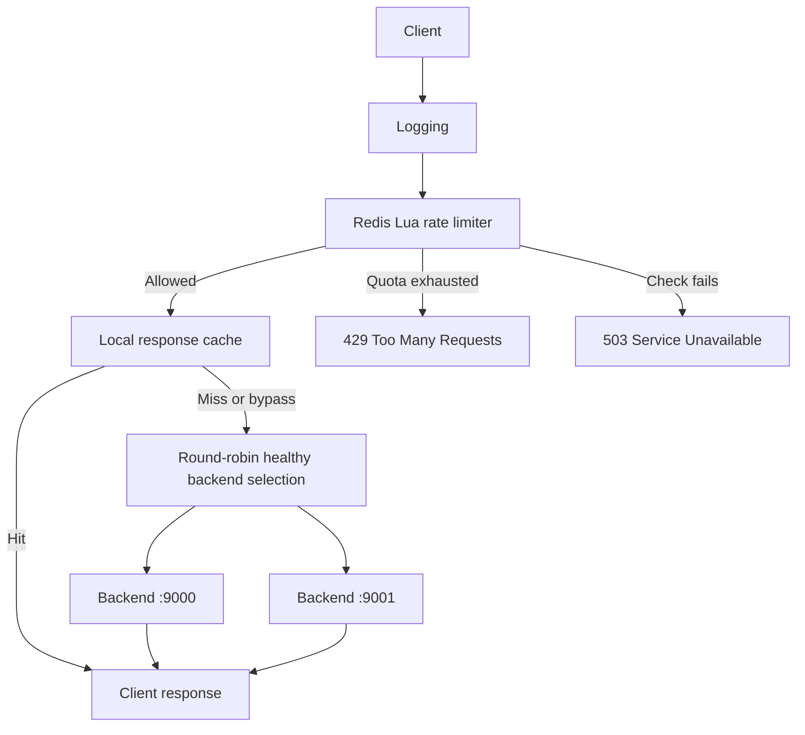

# Redis Rate-Limiting Gateway

A TypeScript reverse proxy built with Node.js HTTP primitives. It applies shared, per-IP rate limits through Redis Lua scripts, balances traffic across healthy backends, and caches eligible GET responses locally.

## Features

- Atomic Redis rate limiting with fixed-window and token-bucket algorithms.
- Shared quotas across gateway processes connected to the same Redis database.
- Round-robin routing across two backend services.
- Periodic health checks and exclusion of unhealthy backends.
- Five-second, per-process response caching for eligible GET requests.
- HTTP 429 responses with `Retry-After`, plus explicit upstream failure responses.
- Request logging with client IP, status, and elapsed time.

## Request flow



The limiter runs before the cache: cache hits also consume quota. Redis stores rate-limit state; response bodies remain in each gateway's local memory.

## Requirements

- Node.js 24 and npm.
- A running Redis server reachable by the gateway.
- Docker is optional for running Redis locally.

## Run locally

```sh
git clone https://github.com/adityavit337/gateway.git
cd gateway
npm ci
npm run typecheck
```

If using Docker, start a local Redis instance:

```sh
docker run --name gateway-redis -p 127.0.0.1:6379:6379 -d redis:8
```

Run the following in **three separate PowerShell terminals**, from the repository directory.

If PowerShell blocks `npm.ps1`, use `npm.cmd` in place of `npm` in these commands.

Backend A:

```powershell
$env:BACKEND_PORT = "9000"
npm run backend
```

Backend B:

```powershell
$env:BACKEND_PORT = "9001"
npm run backend
```

Gateway:

```powershell
$env:REDIS_URL = "redis://localhost:6379"
$env:RATE_LIMIT_ALGORITHM = "fixed-window"
$env:GATEWAY_PORT = "8080"
npm run gateway
```

For Bash, use `BACKEND_PORT=9001 npm run backend` and `REDIS_URL=redis://localhost:6379 RATE_LIMIT_ALGORITHM=fixed-window GATEWAY_PORT=8080 npm run gateway`.

The gateway waits for its Redis connection before listening. `.env.example` documents the variables; the application does not automatically load `.env` files.

## Configuration

| Variable | Default | Purpose |
| --- | --- | --- |
| `REDIS_URL` | `redis://localhost:6379` | Redis connection URL |
| `GATEWAY_PORT` | `8080` | Gateway listening port |
| `RATE_LIMIT_ALGORITHM` | `fixed-window` | `fixed-window` or `token-bucket` |
| `BACKEND_PORT` | `9000` | Port for an individual demo backend |

Backend destinations and the following settings are constants in `src/gateway/server.ts`:

| Setting | Value |
| --- | --- |
| Fixed window | 5 requests per IP per 10 seconds |
| Token bucket | Capacity 5; refill 1 token every 2 seconds |
| Health-check interval | 2 seconds |
| Health-check socket timeout | 1 second |
| Forwarded-request socket timeout | 2 seconds |
| Response-cache TTL | 5 seconds after the full response arrives |

The forwarded-request timeout detects socket inactivity; it is not an absolute end-to-end deadline.

## Rate-limiting design

Each request executes one Lua script inside Redis. Reading state, deciding, and updating happen atomically, preventing concurrent gateways from consuming the same remaining allowance.

**Fixed window:** a counter key is created on the first request with a ten-second expiration. Accepted requests increment it up to five. Further requests receive 429 until the key expires. Windows begin per client, not at global clock boundaries; boundary bursts remain possible.

**Token bucket:** a Redis hash stores fractional tokens and the last update timestamp. The script calculates refill from elapsed time, caps tokens at capacity, and consumes one token when available. No background refill timer is needed. An inactive bucket expires after its calculated time to refill fully, assuming consistent clocks.

Keys follow `gateway:rate-limit:<algorithm>:<base64url-IP>`. Gateway processes must use matching Redis database, prefix, algorithm, and quota settings to share one policy.

## Try the behavior

Examples below use PowerShell and `curl.exe`. On macOS/Linux, use `curl`. Allow the quota to recover between scenarios; use the same hostname consistently so the peer IP representation stays consistent.

### Rate limit

With a fresh default fixed window, issue six requests quickly:

```powershell
1..6 | ForEach-Object { curl.exe -i http://localhost:8080/demo }
```

The first five pass the limiter; the sixth returns 429 with `Retry-After`. Cached responses still count.

### Cache

Send two identical requests within five seconds, with quota available:

```powershell
curl.exe -i http://localhost:8080/cache-demo
curl.exe -i http://localhost:8080/cache-demo
```

Expect `x-cache: MISS` followed by `HIT`. Requests with authorization, cookies, conditional/range headers, cache-control directives, or body indicators bypass this cache. Only eligible successful responses are stored; partial responses, cookies, cache-control headers, and `Vary: *` prevent storage.

### Load balancing

Bypass the cache to observe backend ports alternating while both backends are healthy:

```powershell
curl.exe -i -H "Cache-Control: no-cache" http://localhost:8080/demo
curl.exe -i -H "Cache-Control: no-cache" http://localhost:8080/demo
```

Stop one backend and wait for health detection. Subsequent uncached requests route to the remaining healthy backend. A request during detection can still fail.

### Timeout

```powershell
curl.exe -i http://localhost:8080/slow
```

The demo backend waits five seconds before responding, so an admitted request normally gets 504 after roughly two seconds of upstream inactivity.

### Shared quota across gateways

Start another gateway in a fourth terminal with the same Redis URL and algorithm:

```powershell
$env:GATEWAY_PORT = "8081"
npm run gateway
```

With a fresh fixed window, send three requests to port 8080 and three to 8081 from the same client IP. Only five total should pass the limiter. The response caches and backend rotation remain independent per gateway.

## Failure responses

| Status | Meaning |
| --- | --- |
| 429 | Client quota exhausted; includes calculated `Retry-After` |
| 502 | Upstream connection/request failure before response headers |
| 503 | No healthy backend, or the Redis rate-limit check failed |
| 504 | Upstream inactivity timeout before response headers |

After response headers have been sent, an upstream failure closes the response instead of replacing its status. Redis check errors fail closed. Offline command queuing is disabled, but there is no explicit per-command Redis deadline.

## Source layout

```text
src/
  backend/server.ts           Demo backend, /health, and /slow
  gateway/server.ts           Middleware, routing, health checks, and local cache
  rate-limit/
    redis.ts                 Active Redis adapter and Lua algorithms
    types.ts                 Algorithm and decision contracts
    fixed-window.ts          Standalone in-memory reference implementation
    token-bucket.ts           Standalone in-memory reference implementation
```

## Validation and scope

Run `npm run typecheck` for static checking and use the scenarios above for manual verification. Test files are maintained locally and excluded from this repository snapshot.

This is a learning and portfolio implementation. The cache has no capacity/body-size limit or request coalescing. Token-bucket timestamps come from gateway clocks, so clock skew can affect results. IP quotas group users behind NAT; behind another proxy, the connected peer may be that proxy. Redis state loss or eviction can reset quotas. Redis high availability, authentication for API clients, TLS termination, graceful shutdown, full HTTP proxy header handling, and production observability are outside the current implementation.
